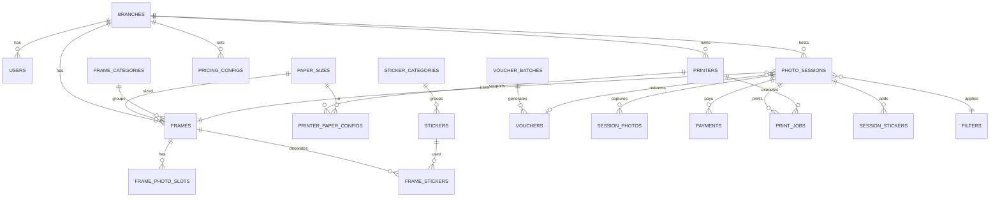

# Rancangan Database Photobooth Multi-Cabang

> Sistem photobooth multi-cabang dengan QRIS payment (Duitku), voucher system, frame builder dengan stiker, multi-printer Epson (L8050/L3210/L1210), dan QR download foto.

**Stack:**
- Laravel 13 + Inertia.js + React + TypeScript
- Tailwind CSS v4 + shadcn/ui
- MySQL 8 / PostgreSQL
- Duitku (QRIS)
- Fabric.js (Frame Builder)
- Spatie Laravel Permission (Role Hierarchy)

---

## 🔄 Flow Sistem Photobooth

Urutan flow customer dari awal sampai selesai:

```
Start Screen
   ↓
Pilih Pembayaran
   ↓
Bayar pakai QRIS / Input Voucher
   ↓
Validasi Pembayaran
   ↓
Pilih Frame
   ↓
Ambil Foto
   ↓
Preview Foto + Retake / Pilih Foto
   ↓
Pilih Filter
   ↓
Pilih Jumlah Print
   ↓
Generate Hasil Final
   ↓
Print Otomatis
   ↓
Tampilkan QR Download Foto
   ↓
Selesai / Kembali ke Home
```

### Mapping Flow ke State Machine (`photo_sessions.status`)

| Flow Step | Status | Current Step |
|---|---|---|
| Start Screen | `started` | `start` |
| Pilih Pembayaran | `payment_pending` | `payment` |
| Bayar QRIS / Voucher | `payment_pending` | `payment` |
| Validasi Pembayaran | `paid` | `payment` |
| Pilih Frame | `paid` | `frame` |
| Ambil Foto | `capturing` | `capture` |
| Preview + Retake | `editing` | `preview` |
| Pilih Filter | `editing` | `filter` |
| Pilih Jumlah Print | `editing` | `quantity` |
| Generate Final | `editing` | `generate` |
| Print Otomatis | `printing` | `print` |
| QR Download | `completed` | `download` |
| Selesai | `completed` | `done` |

---

## ⚙️ Aturan Teknis Wajib

### 1. Backend — Query Eager Loading WAJIB

**SEMUA query yang akses relasi WAJIB pakai eager loading** untuk hindari N+1 problem.

```php
// ❌ SALAH — N+1 problem
$sessions = PhotoSession::all();
foreach ($sessions as $session) {
    echo $session->branch->name;
}

// ✅ BENAR — eager loading
$sessions = PhotoSession::with(['branch', 'frame', 'payment', 'printJobs'])
    ->latest()
    ->paginate(20);

// ✅ BENAR — nested + select kolom spesifik
$sessions = PhotoSession::with([
    'branch:id,name,code',
    'frame.category',
    'frame.photoSlots',
    'payments' => fn($q) => $q->where('status', 'success'),
    'printJobs.printer'
])->paginate(20);

// ✅ BENAR — eager load count
$branches = Branch::withCount(['sessions', 'printers', 'users'])
    ->paginate(20);
```

**Aturan tambahan:**
- Selalu **select kolom spesifik** untuk relasi besar (`branch:id,name`)
- Pakai **`withCount()`** untuk hitung relasi tanpa load datanya
- Pakai **`loadMissing()`** kalau model sudah ada tapi butuh load relasi tambahan
- Pakai **`chunk()` / `lazy()`** untuk proses data besar (>1000 row)

**Contoh controller untuk listing:**

```php
public function index(Request $request)
{
    $sessions = PhotoSession::with([
        'branch:id,name,code',
        'frame:id,name',
        'paperSize:id,code',
    ])
    ->when($request->search, fn($q, $search) => 
        $q->where('session_code', 'like', "%{$search}%")
    )
    ->when($request->branch_id, fn($q, $id) => 
        $q->where('branch_id', $id)
    )
    ->when($request->status, fn($q, $status) => 
        $q->where('status', $status)
    )
    ->latest()
    ->paginate($request->per_page ?? 20)
    ->withQueryString();

    return Inertia::render('Sessions/Index', [
        'sessions' => $sessions,
        'filters' => $request->only(['search', 'branch_id', 'status']),
    ]);
}
```

### 2. Frontend — DataTable WAJIB shadcn/ui

**Semua list data WAJIB pakai DataTable shadcn/ui** (berbasis `@tanstack/react-table`).

**Fitur wajib di setiap DataTable:**
1. Sorting per kolom
2. Filtering/search global
3. Pagination dengan opsi rows per page (10, 25, 50, 100)
4. Column visibility toggle
5. Row selection dengan checkbox untuk bulk action
6. Empty state dengan icon + teks "Belum ada data"
7. Loading skeleton saat fetching
8. **Server-side pagination** (data dari Laravel via Inertia)

### 3. Notification WAJIB Pakai Sonner

```tsx
import { toast } from "sonner";

// Setup di root layout
<Toaster position="top-right" richColors closeButton duration={4000} />

// Success
toast.success("Data berhasil disimpan", {
  description: "Cabang baru telah ditambahkan ke sistem"
});

// Error / Warning / Info / Promise
toast.error("Gagal menyimpan data");
toast.promise(saveData(), {
  loading: "Menyimpan data...",
  success: "Data berhasil disimpan",
  error: "Gagal menyimpan data"
});
```

### 4. Button Aksi WAJIB Icon + Teks

| Variant | Use Case | Contoh |
|---------|----------|--------|
| **Primary** (`bg-[#F5FA0C] text-black`) | Simpan, Submit, Bayar, Lanjut | `<Save /> Simpan` |
| **Secondary** | Batal, Kembali | `<X /> Batal` |
| **Danger** | Hapus, Reset | `<Trash2 /> Hapus` |
| **Warning** | Suspend, Disable | `<Ban /> Nonaktifkan` |
| **Success** | Approve, Activate | `<Check /> Setujui` |
| **Info** | Lihat detail | `<Eye /> Lihat` |

Semua icon pakai **lucide-react**, ukuran `w-4 h-4 mr-2`.

### 5. Form WAJIB Placeholder + Asterisk Required

```tsx
// Field required — WAJIB ada asterisk merah
<Label className="flex items-center gap-1">
  Nama Cabang
  <span className="text-red-600">*</span>
</Label>
<Input placeholder="Contoh: Cabang Jakarta Pusat" />

// Field optional — tanpa asterisk
<Label>Nomor Telepon</Label>
<Input placeholder="Contoh: 081234567890" />
```

**Validation messages WAJIB bahasa Indonesia:**
- `"Nama cabang wajib diisi"`
- `"Format email tidak valid"`
- `"Minimal 8 karakter"`

---

## 1. Cabang & User Management

### Table: `branches`

| Column | Type | Notes |
|---|---|---|
| id | bigint PK | |
| code | string unique | e.g. "JKT-01" |
| name | string | |
| address | text | |
| city | string | |
| province | string | |
| phone | string | |
| manager_name | string | |
| timezone | string | default: Asia/Jakarta |
| is_active | boolean | |
| opened_at | date | |
| settings | json | konfigurasi spesifik cabang |
| created_at | timestamp | |
| updated_at | timestamp | |
| deleted_at | timestamp | soft delete |

### Table: `users`

| Column | Type | Notes |
|---|---|---|
| id | bigint PK | |
| branch_id | bigint FK nullable | super admin bisa null |
| name | string | |
| email | string unique | |
| phone | string | |
| password | string | |
| avatar | string nullable | |
| is_active | boolean | |
| last_login_at | timestamp nullable | |
| timestamps | | |
| deleted_at | timestamp | soft delete |

**Roles (spatie/laravel-permission):**
- `super_admin` — akses semua cabang
- `branch_admin` — admin per cabang
- `operator` — operator photobooth
- `kasir` — handle pembayaran cash backup

---

## 2. Printer Configuration

### Table: `printers`

| Column | Type | Notes |
|---|---|---|
| id | bigint PK | |
| branch_id | bigint FK | |
| name | string | e.g. "Printer Utama L8050" |
| model | enum | `epson_l8050`, `epson_l3210`, `epson_l1210` |
| connection_type | enum | `usb`, `network`, `wifi` |
| ip_address | string nullable | untuk network |
| port | int nullable | default 9100 |
| system_printer_name | string | nama printer di OS (CUPS/Windows) |
| is_default | boolean | |
| is_active | boolean | |
| max_paper_size | enum | `A6`, `A5`, `A4`, `A3`, `4R`, `5R`, `6R` |
| supported_paper_sizes | json | array of paper size codes |
| settings | json | DPI, color profile, dll |
| last_status | enum | `ready`, `busy`, `error`, `offline` |
| last_checked_at | timestamp | |
| timestamps | | |

### Table: `paper_sizes`

| Column | Type | Notes |
|---|---|---|
| id | bigint PK | |
| code | string | "A3", "A4", "4R", dll |
| name | string | |
| width_mm | int | |
| height_mm | int | |
| is_active | boolean | |

### Table: `printer_paper_configs`

| Column | Type | Notes |
|---|---|---|
| id | bigint PK | |
| printer_id | bigint FK | |
| paper_size_id | bigint FK | |
| price_per_print | decimal(10,2) | |
| ink_cost_estimate | decimal(10,2) nullable | |
| is_active | boolean | |

---

## 3. Frame Builder & Sticker Library

### Table: `frame_categories`

| Column | Type | Notes |
|---|---|---|
| id | bigint PK | |
| name | string | "Wedding", "Birthday", "Casual" |
| slug | string unique | |
| icon | string | |
| sort_order | int | |
| is_active | boolean | |

### Table: `frames`

| Column | Type | Notes |
|---|---|---|
| id | bigint PK | |
| branch_id | bigint FK nullable | null = global |
| category_id | bigint FK | |
| name | string | |
| slug | string | |
| description | text nullable | |
| thumbnail_path | string | |
| paper_size_id | bigint FK | |
| orientation | enum | `portrait`, `landscape` |
| photo_slots | int | jumlah slot foto (1, 2, 4, dst) |
| canvas_data | json | data Fabric.js |
| background_path | string nullable | |
| overlay_path | string nullable | |
| price_addon | decimal(10,2) | default 0 |
| is_premium | boolean | |
| is_active | boolean | |
| usage_count | int | default 0 |
| created_by | bigint FK users | |
| timestamps | | |
| deleted_at | timestamp | soft delete |

### Table: `frame_photo_slots`

| Column | Type | Notes |
|---|---|---|
| id | bigint PK | |
| frame_id | bigint FK | |
| slot_number | int | |
| x | int | position dalam canvas |
| y | int | |
| width | int | |
| height | int | |
| rotation | int | default 0 |
| shape | enum | `rectangle`, `circle`, `custom` |
| border_radius | int | |
| mask_path | string nullable | |

### Table: `sticker_categories`

| Column | Type | Notes |
|---|---|---|
| id | bigint PK | |
| name | string | |
| slug | string unique | |
| icon | string | |
| sort_order | int | |
| is_active | boolean | |

### Table: `stickers`

| Column | Type | Notes |
|---|---|---|
| id | bigint PK | |
| category_id | bigint FK | |
| name | string | |
| image_path | string | |
| thumbnail_path | string | |
| is_animated | boolean | |
| tags | json | |
| is_premium | boolean | |
| is_active | boolean | |
| usage_count | int | default 0 |
| timestamps | | |

### Table: `frame_stickers`

Stiker default yang sudah terpasang di frame template.

| Column | Type | Notes |
|---|---|---|
| id | bigint PK | |
| frame_id | bigint FK | |
| sticker_id | bigint FK | |
| x | int | |
| y | int | |
| width | int | |
| height | int | |
| rotation | int | |
| z_index | int | |

---

## 4. Filter Library

### Table: `filters`

| Column | Type | Notes |
|---|---|---|
| id | bigint PK | |
| name | string | "Vintage", "B&W", "Warm", "Cool" |
| slug | string unique | |
| thumbnail_path | string | |
| css_filter | text | e.g. "contrast(1.2) saturate(0.8)" |
| filter_matrix | json | untuk processing di backend |
| sort_order | int | |
| is_active | boolean | |

---

## 5. Voucher System

### Table: `voucher_batches`

| Column | Type | Notes |
|---|---|---|
| id | bigint PK | |
| branch_id | bigint FK nullable | null = berlaku semua cabang |
| name | string | "Promo Lebaran 2026" |
| code_prefix | string | "LEBARAN" |
| discount_type | enum | `percentage`, `fixed`, `free_print` |
| discount_value | decimal(10,2) | |
| max_uses_per_voucher | int | default 1 |
| valid_from | datetime | |
| valid_until | datetime | |
| total_generated | int | |
| total_used | int | |
| is_active | boolean | |
| created_by | bigint FK users | |
| timestamps | | |

### Table: `vouchers`

| Column | Type | Notes |
|---|---|---|
| id | bigint PK | |
| batch_id | bigint FK | |
| code | string unique | "LEBARAN-A4F2K9" |
| used_count | int | |
| max_uses | int | |
| is_active | boolean | |
| used_at | timestamp nullable | |
| used_by_session_id | bigint FK nullable | |
| timestamps | | |

---

## 6. Payment & Transaction (Core)

### Table: `pricing_configs`

Konfigurasi harga per cabang dan per ukuran kertas.

| Column | Type | Notes |
|---|---|---|
| id | bigint PK | |
| branch_id | bigint FK | |
| paper_size_id | bigint FK | |
| base_price | decimal(10,2) | harga per print |
| min_prints | int | |
| max_prints | int | |
| is_active | boolean | |
| timestamps | | |

### Table: `photo_sessions`

Tabel inti — 1 sesi = 1 transaksi customer dari awal sampai print.

| Column | Type | Notes |
|---|---|---|
| id | bigint PK | |
| session_code | string unique | "PB-20260522-0001" |
| branch_id | bigint FK | |
| printer_id | bigint FK nullable | |
| frame_id | bigint FK nullable | |
| filter_id | bigint FK nullable | |
| paper_size_id | bigint FK | |
| status | enum | `started`, `payment_pending`, `paid`, `capturing`, `editing`, `printing`, `completed`, `expired`, `cancelled` |
| current_step | enum | `start`, `payment`, `frame`, `capture`, `preview`, `filter`, `quantity`, `generate`, `print`, `download`, `done` |
| payment_method | enum | `qris`, `voucher`, `mixed` |
| total_amount | decimal(10,2) | |
| discount_amount | decimal(10,2) | default 0 |
| final_amount | decimal(10,2) | |
| voucher_id | bigint FK nullable | |
| duitku_reference | string nullable | |
| duitku_payment_url | text nullable | |
| paid_at | timestamp nullable | |
| print_quantity | int | |
| final_image_path | string nullable | |
| final_image_url | string nullable | |
| download_token | string unique nullable | |
| download_qr_path | string nullable | |
| download_expires_at | timestamp | |
| download_count | int | default 0 |
| started_at | timestamp | |
| completed_at | timestamp nullable | |
| expired_at | timestamp nullable | |
| customer_phone | string nullable | optional |
| customer_email | string nullable | optional |
| operator_id | bigint FK users nullable | |
| ip_address | string | |
| user_agent | text | |
| timestamps | | |

### Table: `session_photos`

| Column | Type | Notes |
|---|---|---|
| id | bigint PK | |
| session_id | bigint FK | |
| slot_number | int | foto ke berapa |
| original_path | string | raw dari webcam |
| processed_path | string nullable | setelah filter |
| is_selected | boolean | dipilih atau di-retake |
| retake_count | int | default 0 |
| captured_at | timestamp | |
| timestamps | | |

### Table: `session_stickers`

Stiker custom yang ditambahkan user di sesi.

| Column | Type | Notes |
|---|---|---|
| id | bigint PK | |
| session_id | bigint FK | |
| sticker_id | bigint FK | |
| x | int | |
| y | int | |
| width | int | |
| height | int | |
| rotation | int | |
| z_index | int | |
| created_at | timestamp | |

### Table: `payments`

| Column | Type | Notes |
|---|---|---|
| id | bigint PK | |
| session_id | bigint FK | |
| method | enum | `qris`, `voucher` |
| amount | decimal(10,2) | |
| duitku_merchant_order_id | string unique nullable | |
| duitku_reference | string nullable | |
| duitku_payment_code | string nullable | |
| qris_string | text nullable | |
| qris_image_path | string nullable | |
| status | enum | `pending`, `success`, `failed`, `expired`, `refunded` |
| paid_at | timestamp nullable | |
| expired_at | timestamp nullable | |
| raw_response | json | response dari Duitku |
| timestamps | | |

### Table: `print_jobs`

History print, support reprint.

| Column | Type | Notes |
|---|---|---|
| id | bigint PK | |
| session_id | bigint FK | |
| printer_id | bigint FK | |
| quantity | int | |
| paper_size_id | bigint FK | |
| file_path | string | |
| status | enum | `queued`, `printing`, `success`, `failed` |
| error_message | text nullable | |
| started_at | timestamp | |
| completed_at | timestamp nullable | |
| retry_count | int | default 0 |
| timestamps | | |

---

## 7. Activity Log & Audit

### Table: `activity_logs`

| Column | Type | Notes |
|---|---|---|
| id | bigint PK | |
| branch_id | bigint FK nullable | |
| user_id | bigint FK nullable | |
| session_id | bigint FK nullable | |
| action | string | `session.started`, `payment.success`, `print.failed` |
| description | text | |
| properties | json | |
| ip_address | string | |
| created_at | timestamp | |

### Table: `printer_logs`

Khusus log printer untuk troubleshooting.

| Column | Type | Notes |
|---|---|---|
| id | bigint PK | |
| printer_id | bigint FK | |
| event | enum | `status_check`, `print_start`, `print_success`, `print_error`, `offline` |
| message | text | |
| meta | json | |
| created_at | timestamp | |

---

## 8. ERD Diagram



---

## 9. Mapping Flow ke Database (Detail Operasi)

| Flow Step | Tabel yang Terlibat | Operasi Database |
|---|---|---|
| **Start Screen** | `photo_sessions` | INSERT row baru, status=`started`, generate `session_code` |
| **Pilih Pembayaran** | `photo_sessions`, `pricing_configs` | Update `payment_method`, hitung `total_amount` dari pricing cabang (eager load `pricingConfig`) |
| **Bayar QRIS / Voucher** | `payments`, `vouchers` | INSERT payment record, call Duitku API, atau validasi voucher (eager load `batch`) |
| **Validasi Pembayaran** | `payments`, `photo_sessions` | Webhook Duitku update status=`success`, session jadi `paid` |
| **Pilih Frame** | `frames`, `frame_photo_slots`, `frame_stickers` | Query `Frame::with(['photoSlots','stickers','paperSize'])->where(...)` |
| **Ambil Foto** | `session_photos` | INSERT per foto, slot_number sesuai `photo_slots` di frame |
| **Preview + Retake** | `session_photos` | Update `is_selected`, increment `retake_count` |
| **Pilih Filter** | `filters`, `photo_sessions` | Update `filter_id`, apply CSS filter di frontend |
| **Pilih Jumlah Print** | `photo_sessions` | Update `print_quantity` |
| **Generate Final** | `photo_sessions`, `session_photos`, `session_stickers` | Composite frame + photos + stickers + filter → save ke `final_image_path` |
| **Print Otomatis** | `print_jobs` | INSERT job, kirim ke printer via queue (Laravel Horizon) |
| **QR Download** | `photo_sessions` | Generate `download_token`, simpan `download_qr_path`, set TTL (24-72 jam) |
| **Selesai** | `photo_sessions`, `activity_logs` | status=`completed`, log activity |

---

## 10. Catatan Implementasi

### 10.1 Multi-Cabang Strategy

Pakai pattern `branch_id` di setiap tabel transaksional. Bikin global scope di trait reusable:

```php
// app/Models/Concerns/BelongsToBranch.php
namespace App\Models\Concerns;

trait BelongsToBranch
{
    protected static function bootBelongsToBranch(): void
    {
        static::addGlobalScope('branch', function ($query) {
            if (auth()->check() 
                && auth()->user()->branch_id 
                && !auth()->user()->hasRole('super_admin')
            ) {
                $query->where('branch_id', auth()->user()->branch_id);
            }
        });

        static::creating(function ($model) {
            if (auth()->check() && !$model->branch_id && auth()->user()->branch_id) {
                $model->branch_id = auth()->user()->branch_id;
            }
        });
    }
}
```

### 10.2 Printer Integration

Spesifikasi printer:
- **Epson L8050** — A3 max, 6-color (cocok untuk foto premium A3/A4)
- **Epson L3210** — A4 max, 4-color (entry level multifungsi)
- **Epson L1210** — A4 max, 4-color (basic, single function)

**Strategi koneksi:**

| OS | Method |
|---|---|
| Windows | `shell_exec("PRINT /D:{printer} {file}")` atau PowerShell `Start-Process -FilePath {file} -Verb Print` |
| Linux/Mac | CUPS via `lp -d {printer} -o media={size} {file}` |
| Universal (recommended) | Node.js print service terpisah, konsumsi job dari Redis queue |

**Settings printer disimpan di `printers.settings` (json):**
```json
{
  "dpi": 300,
  "color_mode": "color",
  "borderless": true,
  "tray": "rear",
  "quality": "best",
  "media_type": "premium_glossy"
}
```

### 10.3 Frame Builder dengan Stiker

- `frames.canvas_data` simpan output JSON dari Fabric.js
- Saat user pilih stiker tambahan di sesi → simpan posisi di `session_stickers`
- Generate final pakai **Intervention Image** atau **Imagick** untuk composite ulang
- Frame builder admin = drag-drop editor pakai Fabric.js, output JSON yang di-save ke `canvas_data`

### 10.4 QR Download dengan TTL

```php
// Generate download token
$session->update([
    'download_token' => Str::random(40),
    'download_expires_at' => now()->addHours(48),
]);

// URL: https://photobooth.test/d/{token}
// Generate QR via simple-qrcode atau bacon/bacon-qr-code
```

### 10.5 Session State Machine

Pakai `spatie/laravel-model-states` agar transisi state bersih dan ada validasi:

```
started → payment_pending → paid → capturing → editing → printing → completed
                ↓                                                       
            expired/cancelled                                          
```

Tidak bisa skip dari `started` langsung ke `printing` tanpa lewat `paid`.

### 10.6 Scheduled Cleanup

```php
// app/Console/Kernel.php
$schedule->command('sessions:cleanup-expired')->hourly();
$schedule->command('sessions:cleanup-downloaded')->daily();
$schedule->command('printers:health-check')->everyFiveMinutes();
```

Tugas:
- Hapus `session_photos` dari sesi `expired`/`cancelled`
- Hapus `final_image_path` setelah `download_expires_at` lewat
- Set status sesi → `expired` kalau `started_at` > 30 menit dan belum paid
- Health check semua printer aktif, update `last_status`

---

## 11. Migration Order

Urutan jalanin migration biar FK tidak error:

```
1. branches
2. users (+ FK ke branches)
3. roles & permissions (spatie)
4. paper_sizes
5. printers (+ FK ke branches)
6. printer_paper_configs
7. pricing_configs
8. frame_categories
9. frames
10. frame_photo_slots
11. sticker_categories
12. stickers
13. frame_stickers
14. filters
15. voucher_batches
16. vouchers
17. photo_sessions
18. session_photos
19. session_stickers
20. payments
21. print_jobs
22. activity_logs
23. printer_logs
24. ALTER vouchers ADD FK used_by_session_id → photo_sessions (circular dependency)
```

---

## 12. Estimasi Total Tabel

**24 tabel** (di luar tabel default Laravel + Spatie permission).

| Kategori | Jumlah |
|---|---|
| Master Data | 8 (branches, users, paper_sizes, printers, printer_paper_configs, frame_categories, sticker_categories, filters) |
| Frame Builder | 4 (frames, frame_photo_slots, stickers, frame_stickers) |
| Voucher | 2 (voucher_batches, vouchers) |
| Transactional | 6 (pricing_configs, photo_sessions, session_photos, session_stickers, payments, print_jobs) |
| Logging | 2 (activity_logs, printer_logs) |
| Roles/Permissions (spatie) | 5 (auto-generated) |

---

**Selesai.** Dokumen ini siap dijadikan blueprint untuk fase 1 development.
